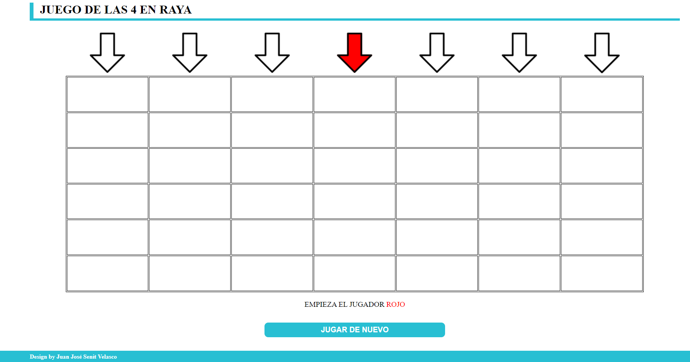

# JUEGO DE LAS 4 EN RAYA

El clásico juego en el que se dispone de un tablero en el cual se introducen las fichas por la parte superior.
Se enfrentan dos jugadores (rojo y azul) en donde, por turnos, cada uno introduce la ficha de su color correspondiente. Gana el que primero haga las 4 en raya (en horizontal, vertical o diagonal)
___
## DESARROLLO DE UNA PARTIDA

En la primera imagen se muestra el tablero inicial, con el jugador que empieza

En la segunda se observa en final de una partida, en la cual ha ganado el jugador azul, ya que ha conseguido realizar las 4 en raya, marcándose el resultado ganador

___

## CÓMO JUGAR

1. Clonar el repositorio y **ejecutar** el **index.html**
2. Aprovechando la herramienta de GitHub Pages desde el siguiente enlace:

    > <https://juanjosesenit.github.io/CuatroEnRaya/>